# Test Performance vs Temperature + Magnitude (Continuous Scores)

Last updated: 2026-01-12

## Objective
Measure test-set detection performance of MSP/Doctor as a function of temperature and magnitude, across multiple splits, to understand how ODIN-style perturbations affect ranking quality.

## Setup
- Dataset config: `configs/datasets/cifar10/cifar10_n-cal-5000.yml`
- Model config: `configs/models/cifar10_resnet34.yml`
- Splits: res=0, cal=5000, test=5000 (seed splits 1–9)
- Scores:
  - `msp` (ODIN): negative max softmax probability (higher = more error-like)
  - `doctor`: Doctor postprocessor (normalize=True)
  - `margin`: 1 − (max prob − second max prob) (higher = more error-like)
- Grid:
  - temperature: 0.7, 0.8, 0.9, 1.0, 1.1, 1.2
  - magnitude: 0.0, 0.002, 0.004, 0.006, 0.008, 0.01, 0.012
- Metrics: ROC-AUC and FPR@95 on test

## Plots (mean ± std over seeds 1–9)
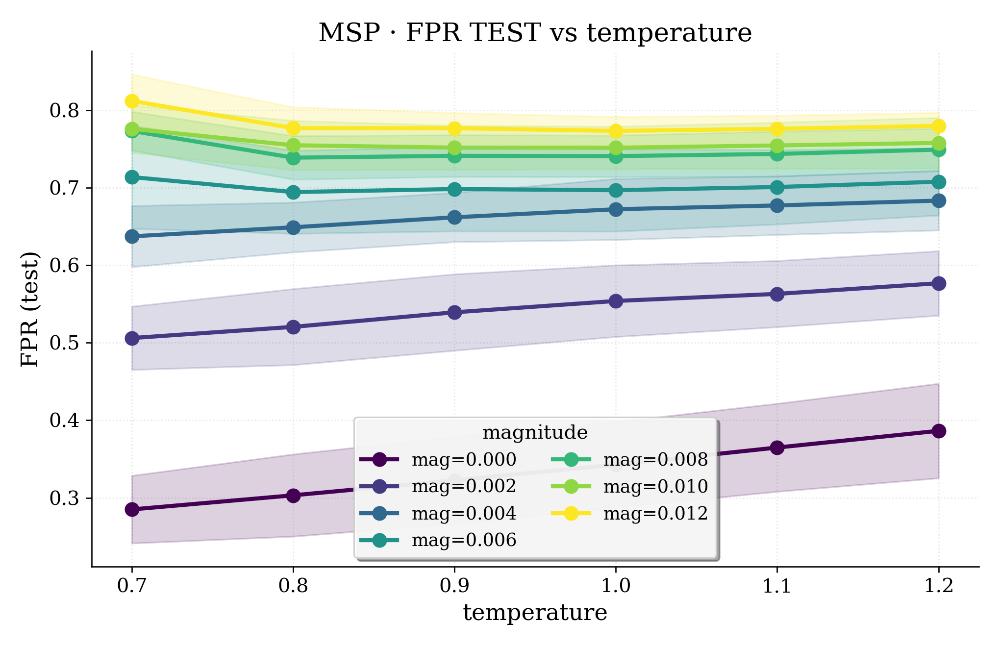
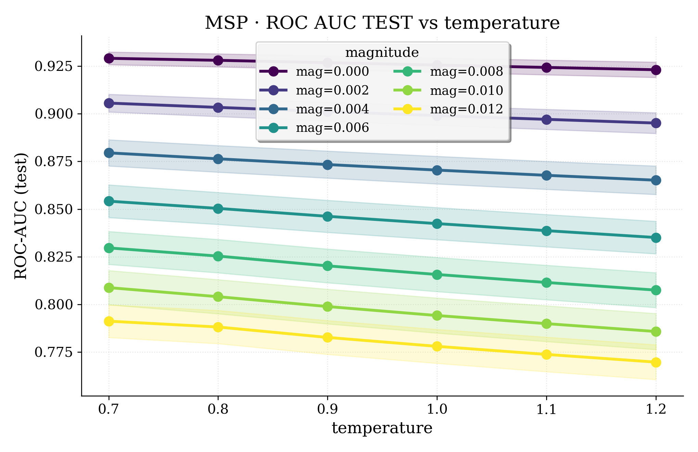

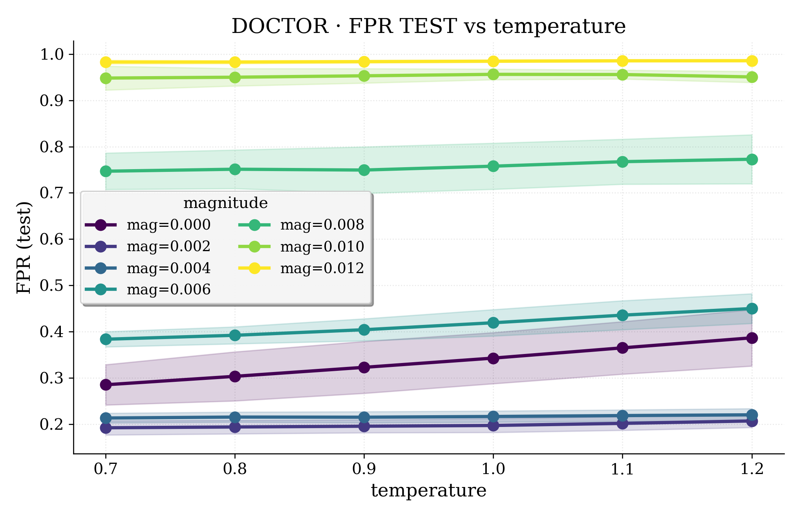
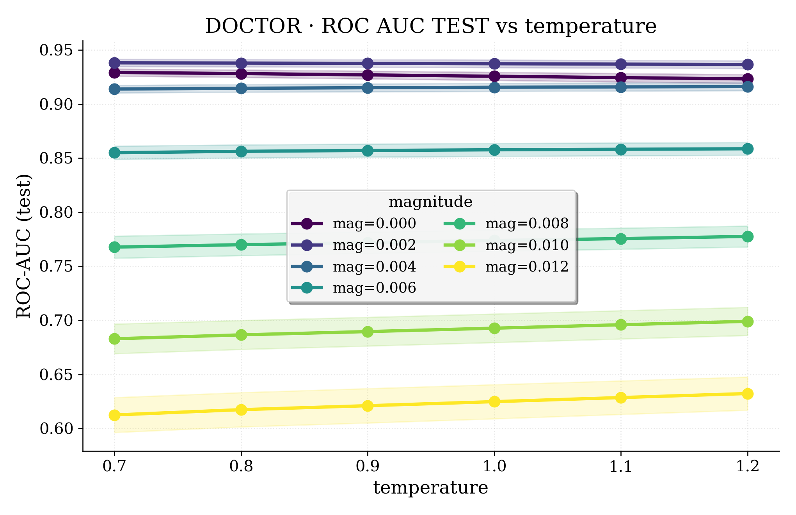

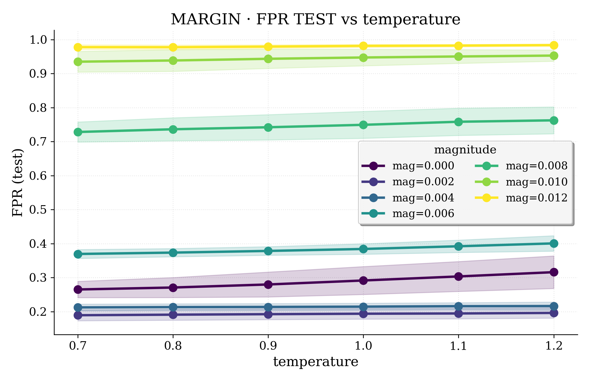
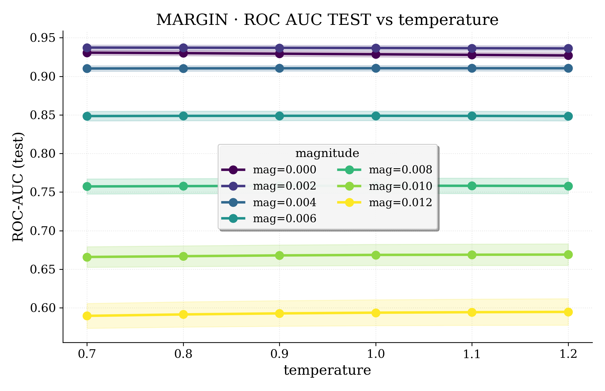

## Heatmaps (mean over seeds 1–9)
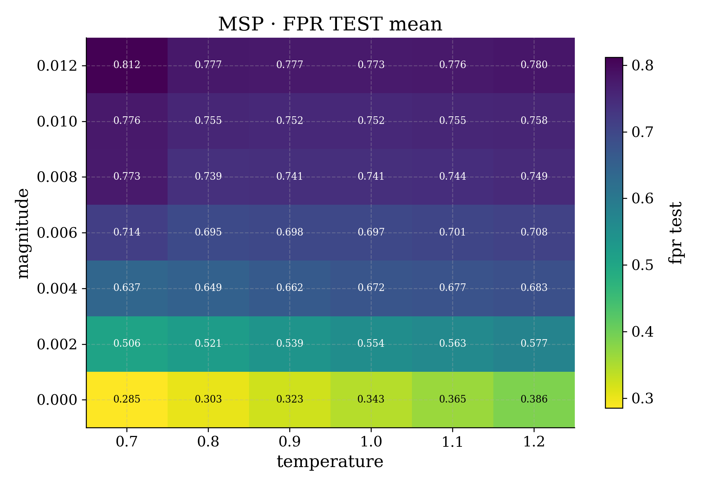
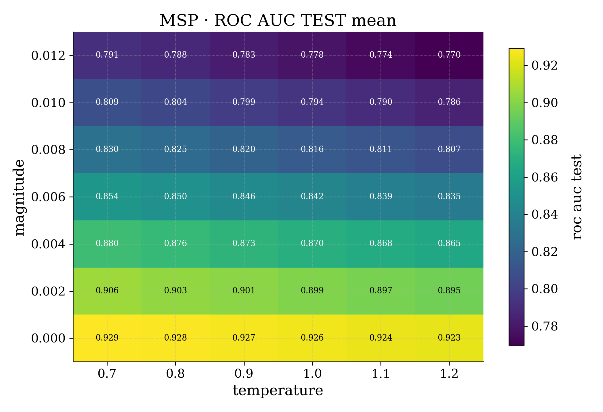

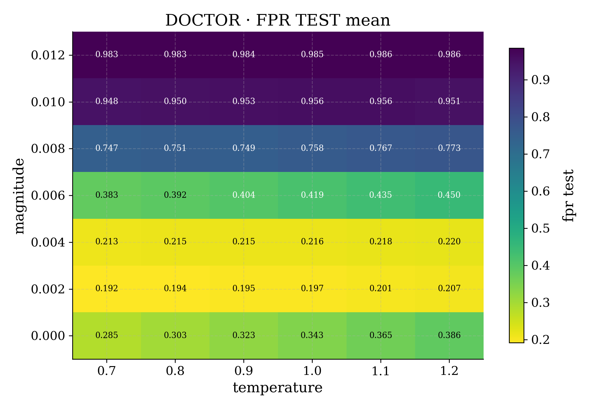
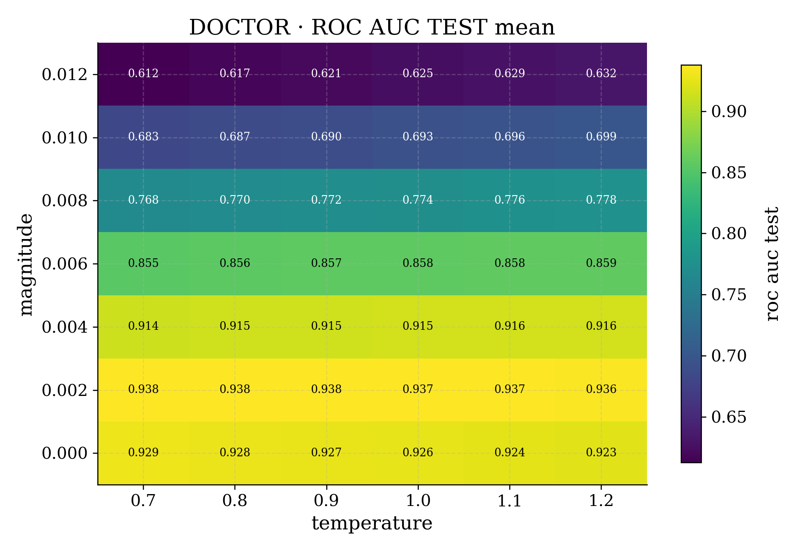

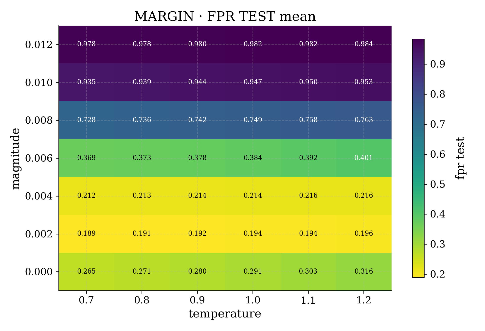
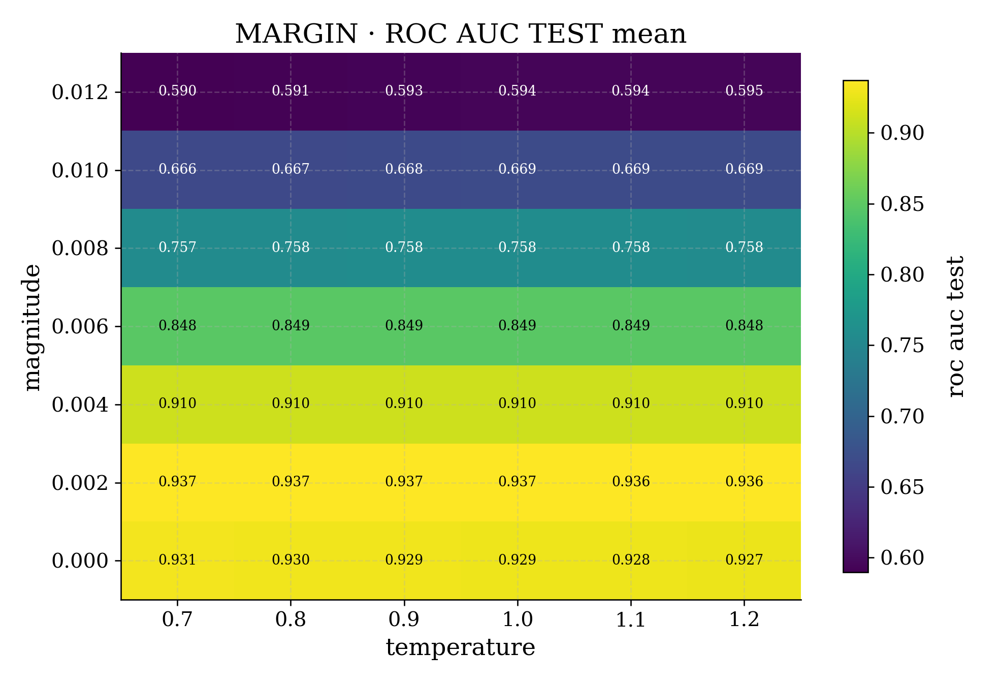

## Best hyperparameters selected on calibration set
Per seed, select the hyperparameters that optimize the calibration metric, then report test performance of the selected hyperparameters (mean ± std over seeds 1–9).

| score | selection | temp | mag | fpr_test | roc_auc_test |
|---|---|---|---|---|---|
| msp | best fpr_cal | 0.700 ± 0.000 | 0.0000 ± 0.0000 | 0.2849 ± 0.0411 | 0.9291 ± 0.0031 |
| msp | best roc_auc_cal | 0.700 ± 0.000 | 0.0000 ± 0.0000 | 0.2849 ± 0.0411 | 0.9291 ± 0.0031 |
| doctor | best fpr_cal | 0.722 ± 0.042 | 0.0029 ± 0.0010 | 0.2038 ± 0.0144 | 0.9267 ± 0.0124 |
| doctor | best roc_auc_cal | 0.756 ± 0.068 | 0.0020 ± 0.0000 | 0.1931 ± 0.0149 | 0.9378 ± 0.0033 |
| margin | best fpr_cal | 0.822 ± 0.162 | 0.0031 ± 0.0010 | 0.2059 ± 0.0148 | 0.9219 ± 0.0133 |
| margin | best roc_auc_cal | 0.722 ± 0.042 | 0.0020 ± 0.0000 | 0.1893 ± 0.0155 | 0.9371 ± 0.0032 |

## Reproduce
```bash
python -m error_estimation.experiments.run_detection \
  --config-dataset configs/datasets/cifar10/cifar10_n-cal-5000.yml \
  --config-model configs/models/cifar10_resnet34.yml \
  --config-detection configs/postprocessors/msp/cifar10_resnet34_hyperparams_search.yml \
  --metric fpr \
  --eval-grid \
  --no-mlflow

python -m error_estimation.experiments.run_detection \
  --config-dataset configs/datasets/cifar10/cifar10_n-cal-5000.yml \
  --config-model configs/models/cifar10_resnet34.yml \
  --config-detection configs/postprocessors/doctor/cifar10_resnet34_hyperparams_search.yml \
  --metric fpr \
  --eval-grid \
  --no-mlflow

python -m error_estimation.experiments.run_detection \
  --config-dataset configs/datasets/cifar10/cifar10_n-cal-5000.yml \
  --config-model configs/models/cifar10_resnet34.yml \
  --config-detection configs/postprocessors/margin/cifar10_resnet34_hyperparams_search.yml \
  --metric fpr \
  --eval-grid \
  --no-mlflow
```

## Observation
MSP performance peaks at temperature 0.7 with zero magnitude for both selection criteria. Doctor benefits from a small positive magnitude (≈0.002), and calibration-selected hyperparameters improve ROC-AUC while keeping FPR lower than MSP. Margin tracks Doctor closely for ROC-AUC when selected by roc_auc_cal, with slightly higher FPR in this grid.
