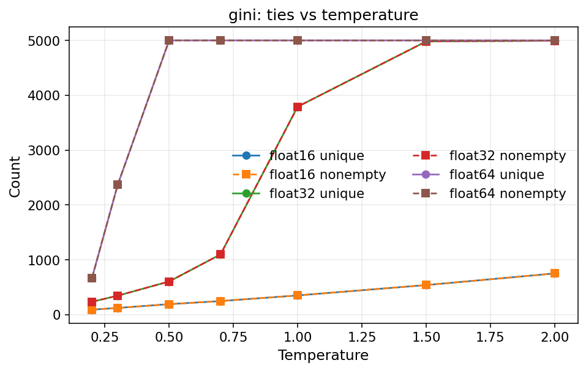
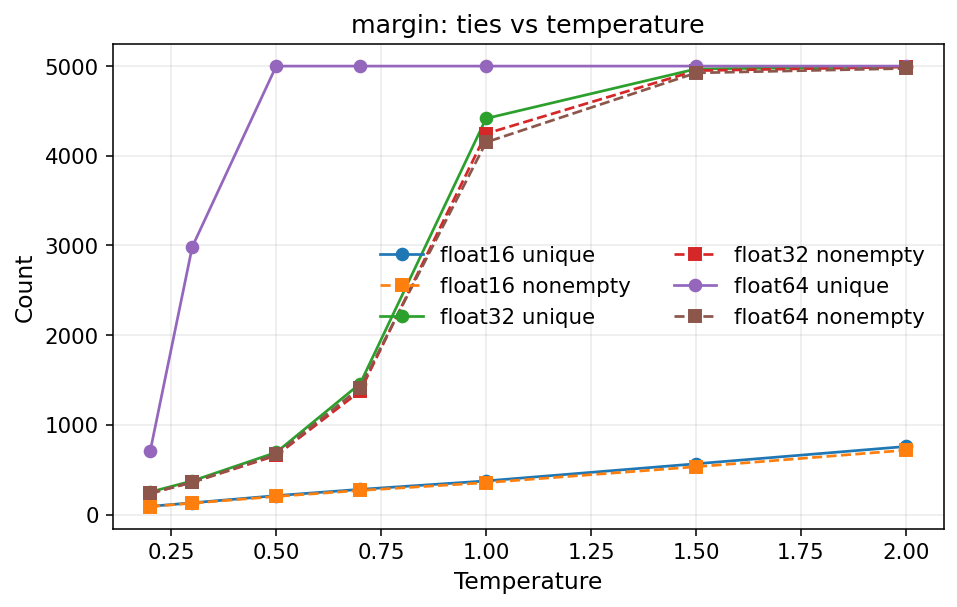

# Max-Proba Ties vs Temperature (Local Replication)

Last updated: 2026-01-08

## Objective
Replicate the unif-mass bin collapse observed on the server and isolate the role of temperature, score choice, and float precision in creating ties.

## Setup
- Latent file: `error-estimation/latent_cache/cifar10_resnet34_ce_transform-test_n-epochs-1_full.pt`
- Subsample: 5000 points (seed=9)
- Scores: `max_proba`, `gini`, `margin` (max prob minus second max prob)
- Binning: uniform-mass with K=5000
- Temperatures: 0.2, 0.3, 0.5, 0.7, 1.0, 1.5, 2.0
- Precisions: float16 (eps=9.77e-04), float32 (eps=1.19e-07), float64 (eps=2.22e-16)

## Results
Lower temperatures sharpen softmax outputs and increase ties, which collapses many quantile bins (non-empty bins << K). At temperature 0.7 with max-proba and float32, the unique-score count and non-empty bin count match the server observation (1097).

See `docs/partition_binning_assets/max_proba_temperature/max_proba_temperature_summary.csv` for the full grid (scores × temperatures × precisions).





## Reproduce
```bash
python scripts/diagnostics/max_proba_temperature_analysis.py \
  --latent-path latent_cache/cifar10_resnet34_ce_transform-test_n-epochs-1_full.pt \
  --output-dir docs/partition_binning_assets/max_proba_temperature \
  --temperatures 0.2 0.3 0.5 0.7 1.0 1.5 2.0 \
  --k 5000 \
  --n-samples 5000 \
  --seed 9 \
  --scores max_proba gini margin \
  --dtypes float16 float32 float64
```
