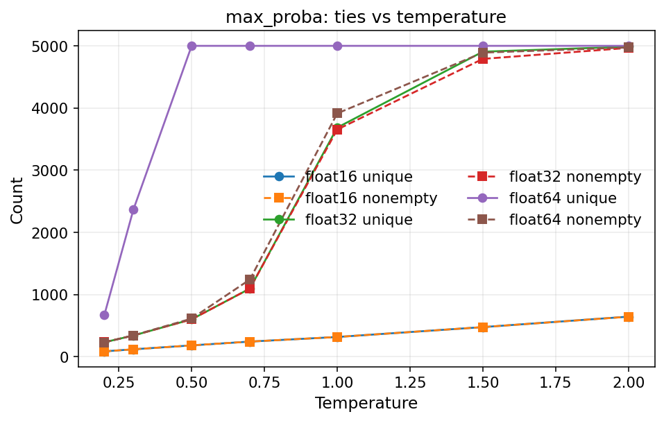

# Max-Proba Ties vs Temperature (Local Replication)

Last updated: 2026-01-08

## Objective
Replicate the unif-mass bin collapse observed on the server and isolate the role of temperature in creating ties for the max-proba score.

## Setup
- Latent file: `error-estimation/latent_cache/cifar10_resnet34_ce_transform-test_n-epochs-1_full.pt`
- Subsample: 5000 points (seed=9)
- Score: `max_proba` (negative max softmax probability)
- Binning: uniform-mass with K=5000
- Temperatures: 0.5, 0.7, 1.0, 1.5, 2.0

## Results
Lower temperatures sharpen softmax outputs and increase ties, which collapses many quantile bins (non-empty bins << K). At temperature 0.7, the unique-score count and non-empty bin count match the server observation (1097).

| temperature | unique_scores | nonempty_bins | max_bin_count |
| --- | --- | --- | --- |
| 0.5 | 603 | 603 | 3701 |
| 0.7 | 1097 | 1097 | 114 |
| 1.0 | 3686 | 3655 | 7 |
| 1.5 | 4906 | 4790 | 3 |
| 2.0 | 4986 | 4967 | 2 |



## Reproduce
```bash
python scripts/diagnostics/max_proba_temperature_analysis.py \
  --latent-path latent_cache/cifar10_resnet34_ce_transform-test_n-epochs-1_full.pt \
  --output-dir docs/partition_binning_assets/max_proba_temperature \
  --temperatures 0.5 0.7 1.0 1.5 2.0 \
  --k 5000 \
  --n-samples 5000 \
  --seed 9
```
