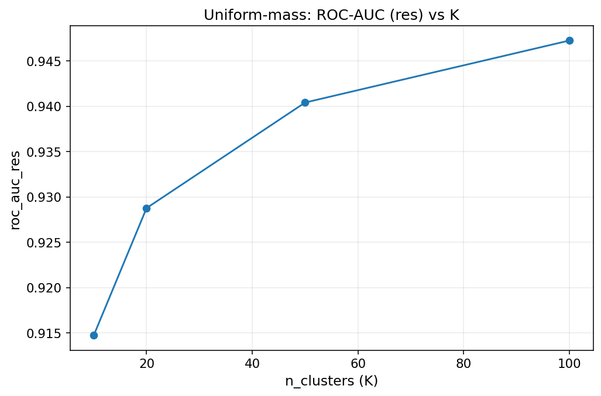
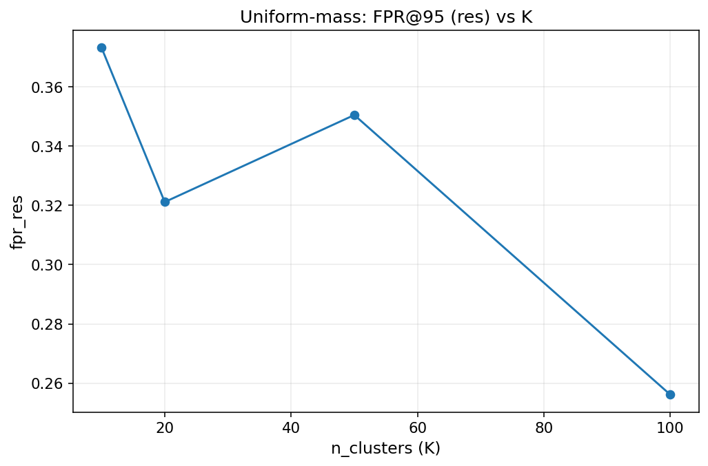

# Uniform-Mass Binning Investigation Report

Last updated: 2026-01-07

## Objective
Understand how uniform-mass binning affects detection performance relative to the continuous score, and identify why performance drops.

## Experimental setup
- Dataset: CIFAR-10
- Model: ResNet-34 (preprocessor: `ce`)
- Score: Gini (doctor-style), temperature = 1.0
- Split: res = 3000, cal = 2000, test = 5000, seed-split = 9
- Metric used for selection: ROC-AUC on res (search_res)
- Guarantee: bins learned on res, confidence intervals on cal, evaluation on test

## Notation and parameters
- `K`: number of uniform-mass bins (quantile bins).
- res/cal/test: resolution split for binning, calibration split for CIs, and test for evaluation.
- FPR@95: false positive rate at 95% true positive rate on the test split.

## Methods compared
- Continuous score (no binning)
- Uniform-mass (quantile bins)

## Runs and artifacts (server paths)
- Uniform-mass ablation (grid search):  
  `results/cifar10/resnet34_ce/partition/runs/unif-mass-ablation/seed-split-9/diagnostics/`
- Uniform-mass ablation (search grid saved):  
  `results/cifar10/resnet34_ce/partition/runs/unif-mass-ablation-search/seed-split-9/diagnostics/`

## Summary metrics (test set)

| Method | Bin config | ROC-AUC | FPR@95 | AUPR_in | AUPR_out |
| --- | --- | --- | --- | --- | --- |
| Continuous | n/a | 0.9219 | 0.3560 | 0.4000 | 0.9952 |
| Uniform-mass (best grid) | k=100 | 0.8956 | 0.4063 | 0.3445 | 0.9920 |

Notes:
- "Continuous" is the raw 1D score (no binning).
- "Best grid" is selected by ROC-AUC on the res split; the table reports test metrics only.

## Initial observations
- Uniform-mass binning reduces ROC-AUC and increases FPR@95 relative to the continuous score.
- The gap suggests that quantization loses ranking resolution in the operating region.
- Continuous scoring remains the strongest for ranking metrics.

## Interpretation guide for diagnostics plots
Use these plots to diagnose where binning hurts performance and why:
- CI vs score: confidence intervals and bin means vs score center. Look for wide CIs near the decision threshold (large uncertainty where it matters).
- Width vs half-width: bin width vs CI half-width. Wide bins with large half-widths indicate poor resolution and high variance.
- Bin width histogram: distribution of bin widths. Heavy tails imply many coarse bins (often in score extremes).
- Count shift: cal vs test counts per bin. Large deviations suggest distribution shift that can inflate uncertainty.

## Evidence summary from plots (to read alongside the figures)
- The gap between continuous and binned ROC-AUC is consistent with fewer distinct score levels; check the bin width histogram and width vs half-width for wide bins with large CI half-widths.
- Larger K improves ROC-AUC on res, indicating that finer binning helps ranking; see the ROC-AUC vs K curve.

## Grid search highlights (res split)
Uniform-mass (res split, used only for selection; not a performance report):
| n_clusters | roc_auc_res | fpr_res |
| --- | --- | --- |
| 100 | 0.9472 | 0.2561 |
| 50 | 0.9404 | 0.3505 |
| 20 | 0.9288 | 0.3211 |
| 10 | 0.9147 | 0.3732 |

## Figures (embedded)
These figures are rendered from the downloaded diagnostics CSVs for readability.

### Uniform-mass (best grid)

### Grid search summaries (res split)

## Next steps (analysis plan)
1) Inspect per-bin diagnostics to see if loss is concentrated in tails (wide bins).
2) Compare bin-width distributions across K (see the bin width histogram).
3) Extend the grid to K=200 for sensitivity (if runtime allows).
