# Partition Binning Investigation Report

Last updated: 2026-01-23

## Objective
Quantify how uniform-mass binning behaves when only a calibration split is available (n_cal=5000, n_res=0), and compare upper-bound scoring vs empirical-mean scoring against the continuous-score baseline.

## Experimental setup (cal-only)
- Datasets: CIFAR-10, CIFAR-100
- Model: ResNet-34 (preprocessor: `ce`)
- Score space: gini, temperature = 1.0 (for the plots below)
- Splits: res = 0, cal = 5000, test = 5000
- Seed splits: 1–9
- Binning: uniform-mass bins learned on cal, CIs computed on cal
- Metrics: ROC-AUC, FPR@95 on test
- K grid: 5, 10, 20, 30, 50, 75, 100, 150, 200, 300, 500

## Existing uniform-mass experiments (local + server)
### Local plots (this report)
- Cal-only protocol, gini space, temperature = 1.0, alpha in {0.05, 0.1, 0.5}.
- Curves and diagnostics are stored in `docs/partition_binning_assets/` (see below).

### Server runs (read-only, `/home/lamsade/msammut/error_detection/error-estimation`)
1) **Cal-only, n_cal=5000, CIFAR-10/ResNet-34, max_proba space**
   - Path: `results_hyperparams/partition_unif-mass/cifar10_resnet34/n_cal-5000/seed-split-*/results_opt-fpr_qunatiz-metric-fpr-ratio-None_n-split-val-1_weight-std-0.0_mode-evaluation.csv`
   - Seeds: 1–9
   - Scores: `mean` and `upper`
   - Bounds: Hoeffding
   - Alpha: 0.05 and 0.5
   - Temperature: 0.7, magnitude: 0.0
   - K grid: 2–20 (step 1), then 30–5000 (step 10)

2) **Res+cal protocol (seed 9 only)**
   - Path: `results_main/partition_unif-mass/cifar10_resnet34/n_res-2000_n_cal-3000/seed-split-9/`
   - Files: `results_opt-fpr_..._mode-evaluation.csv` and `hyperparams_results_opt-fpr_..._mode-search_cv_n-folds-10.csv`
   - Useful for comparing a res-based selection vs cal-only selection.

## Curves shown
- Upper CI score with alpha in {0.05, 0.1, 0.5}
- Empirical mean score per bin
- Continuous score baseline (red horizontal line)
- Alpha affects only the upper-bound curve; the mean curve is alpha-invariant.

## Plots

### CIFAR-10 / ResNet-34


### CIFAR-100 / ResNet-34


## CDF K-means vs Soft-kmeans (n_res=1000)
Curves use the seed-9 grid runs with CDF-transformed gini scores (doctor res-selected). Each curve is the mean over the 5 random inits for a given K. The raw-score line is the res-selected doctor baseline (same configuration used for the CDF runs).

### CIFAR-10 / ResNet-34 (CDF k-means)
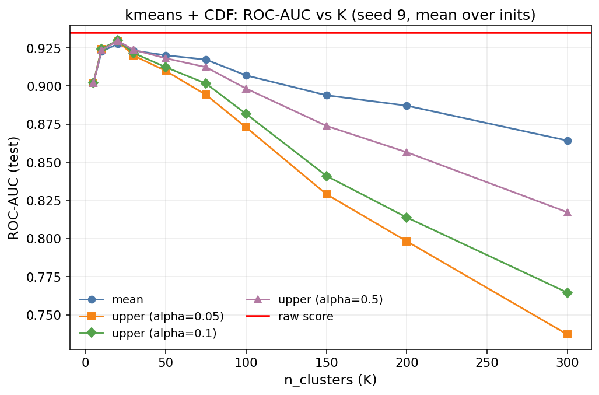
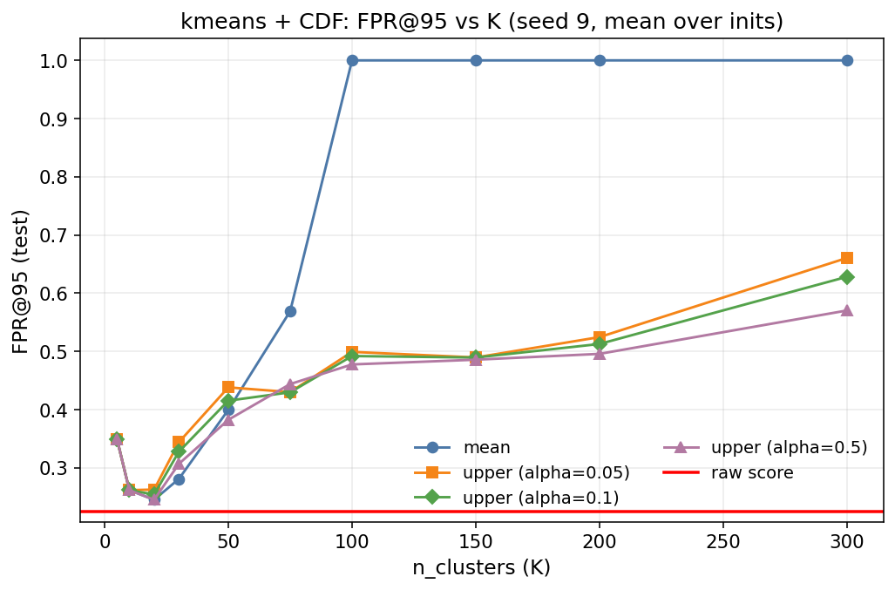

### CIFAR-10 / ResNet-34 (CDF soft-kmeans)
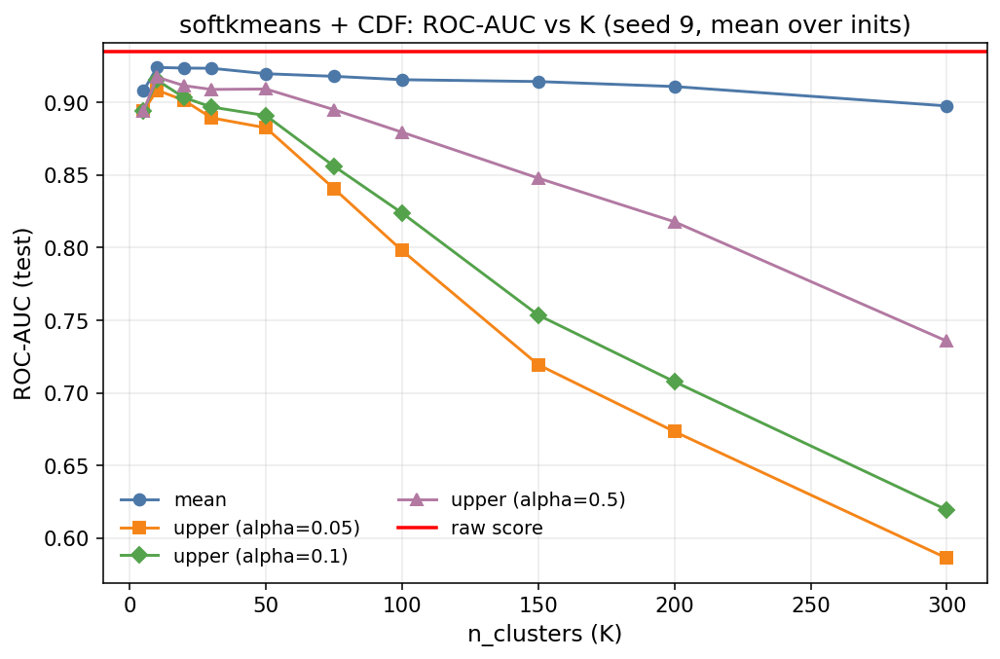
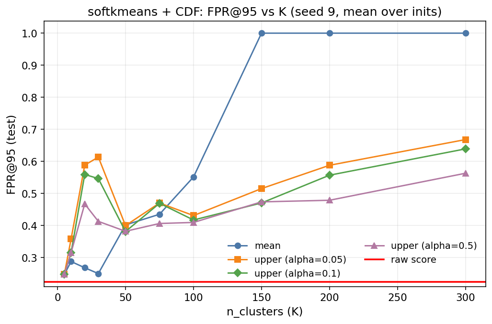

## Diagnostic: CDF vs uniform-mass bin occupancy (n_res=1000)
Diagnostics use perturbed logits (doctor res-selected; temperature=0.9, magnitude=0.002, normalize=true). Counts are shown on the test split for K=20 and K=30.

### CDF score distribution
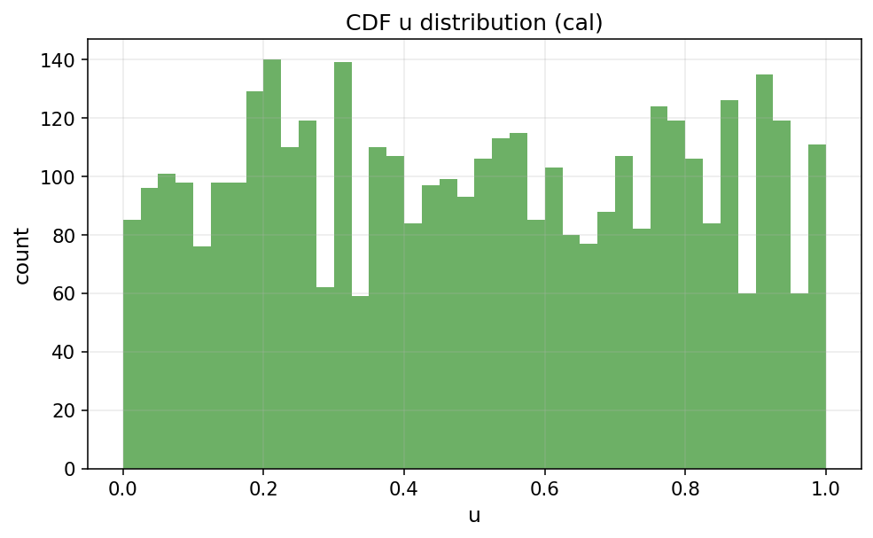
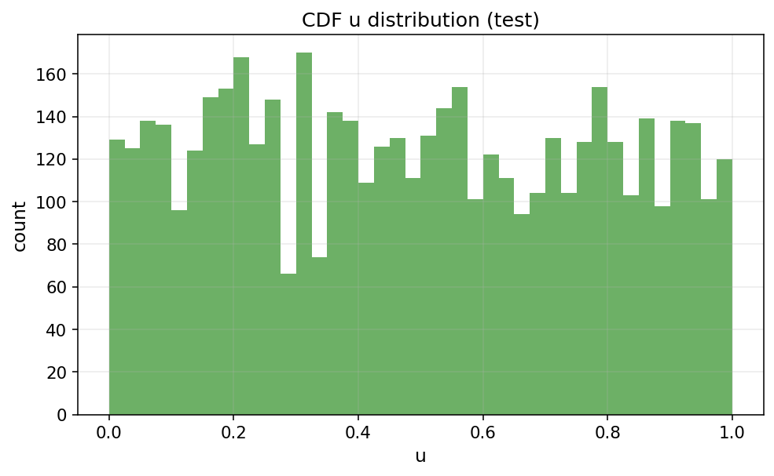

### K=20 counts on test
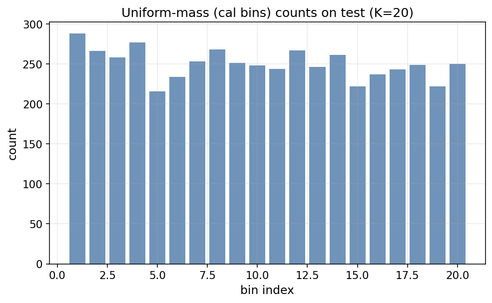
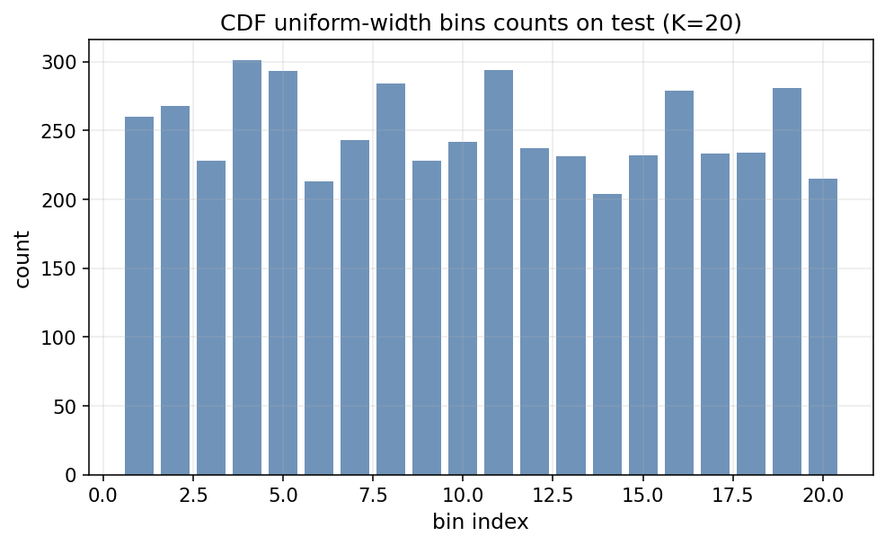
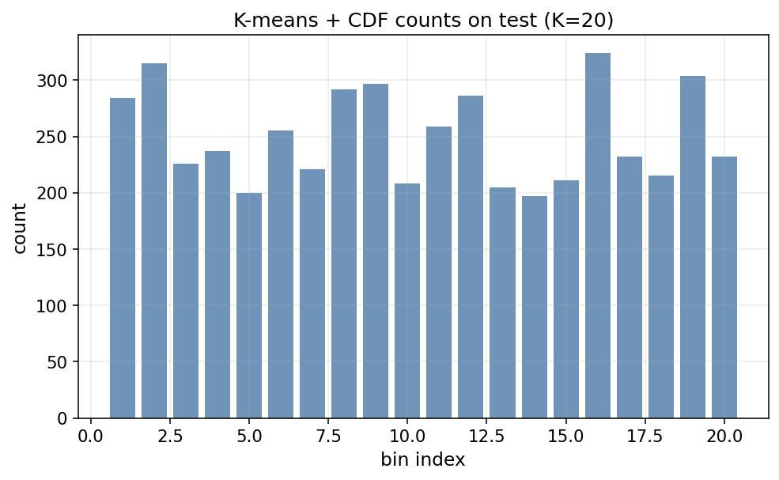

### K=30 counts on test
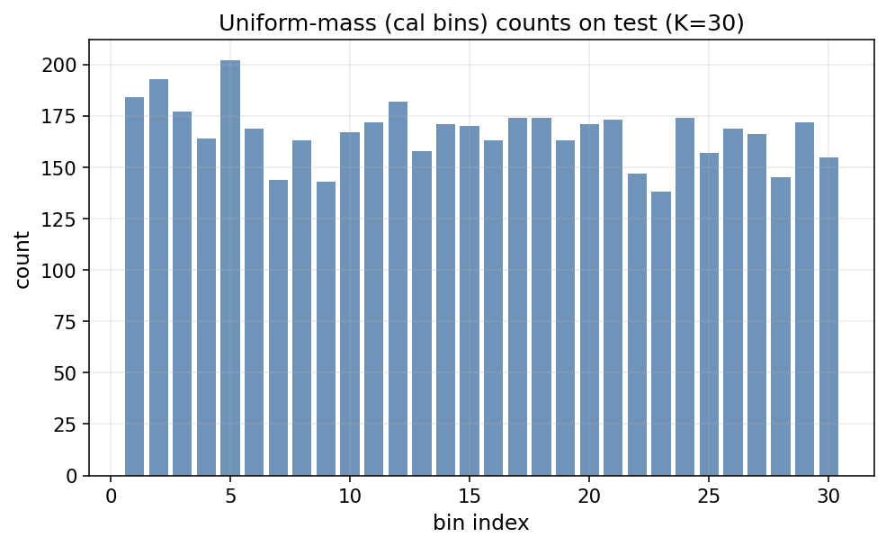
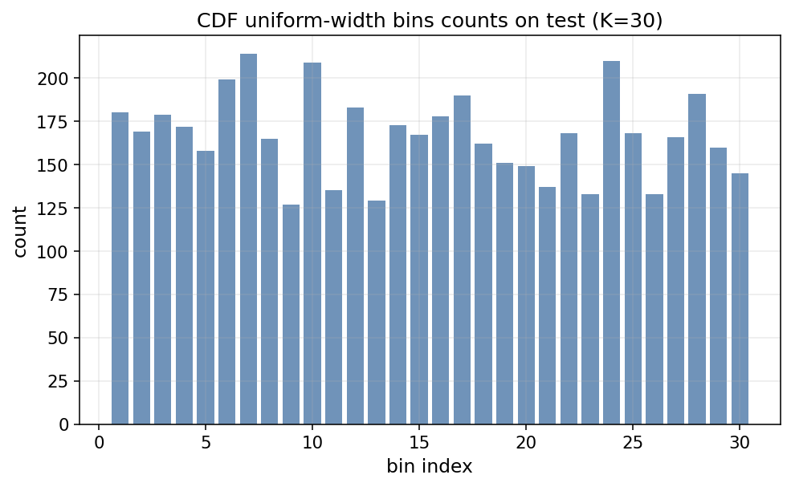
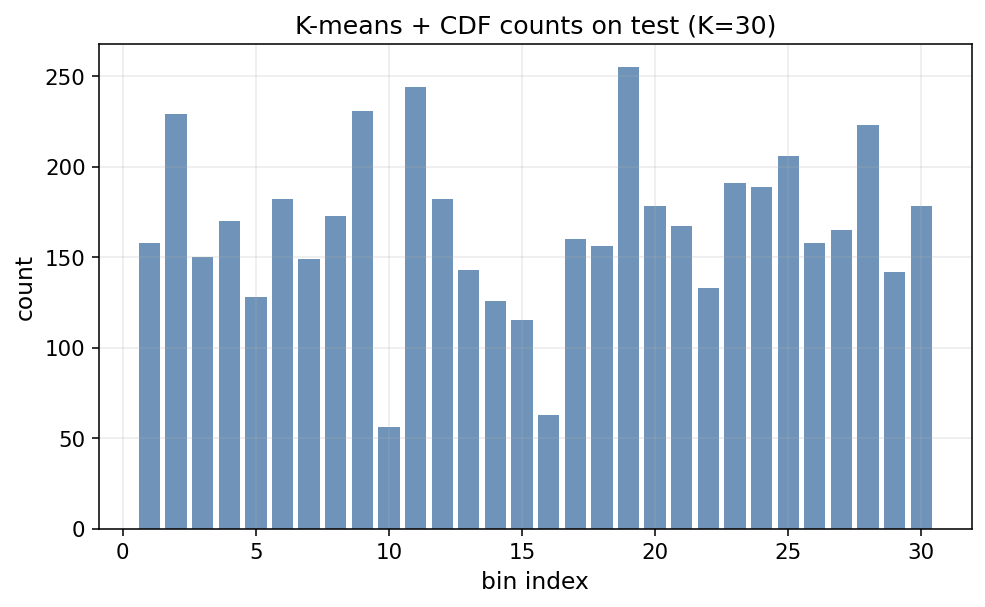

## Best-K diagnostics (seed 9)
Best ROC-AUC on test (upper, alpha=0.05) occurs at K=20 for both datasets. The plots below show the bin-level confidence intervals and empirical means for that K using the seed-9 split (the last seed saved by the sweep).

### CIFAR-10 / ResNet-34 (K=20)


### CIFAR-100 / ResNet-34 (K=20)
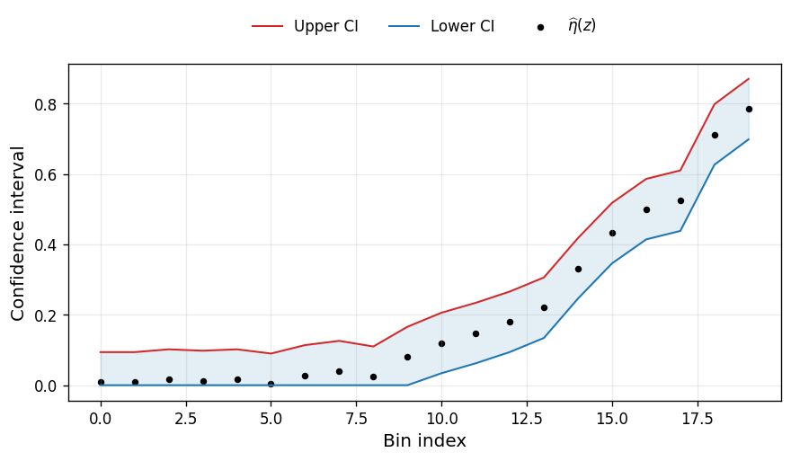

## Reproduce
Use `ablation_k_test_curve.py` with cal-only splits and seeds 1–9, then copy the plots into `partition_binning_assets/`.

Example (CIFAR-10):
```bash
python scripts/diagnostics/ablation_k_test_curve.py \
  --latent-path <latent/full.pt> \
  --output-dir ./results/partition_binning/calonly_alpha/cifar10 \
  --output-prefix unif_mass_calonly_alpha_cifar10 \
  --n-res 0 \
  --n-cal 5000 \
  --n-test 5000 \
  --seed-splits 1 2 3 4 5 6 7 8 9 \
  --n-classes 10 \
  --k-values 5 10 20 30 50 75 100 150 200 300 500 \
  --space gini \
  --temperature 1.0 \
  --alpha-values 0.05 0.1 0.5 \
  --include-mean \
  --include-continuous \
  --bin-split cal \
  --ci-split cal
```

Example (CIFAR-100):
```bash
python scripts/diagnostics/ablation_k_test_curve.py \
  --latent-path <latent/full.pt> \
  --output-dir ./results/partition_binning/calonly_alpha/cifar100 \
  --output-prefix unif_mass_calonly_alpha_cifar100 \
  --n-res 0 \
  --n-cal 5000 \
  --n-test 5000 \
  --seed-splits 1 2 3 4 5 6 7 8 9 \
  --n-classes 100 \
  --k-values 5 10 20 30 50 75 100 150 200 300 500 \
  --space gini \
  --temperature 1.0 \
  --alpha-values 0.05 0.1 0.5 \
  --include-mean \
  --include-continuous \
  --bin-split cal \
  --ci-split cal
```

Copy the resulting `*_roc_auc.png` and `*_fpr.png` plots into `partition_binning_assets/` using the filenames referenced above.

---

## Supervised Partition Experiments (ImageNet)

Last updated: 2026-01-23

### Objective
Compare supervised partition methods (risk-aware recursive partitioning using error labels) against unsupervised UniformMass binning on ImageNet.

### Experimental Setup
- **Dataset:** ImageNet (n_res=5000, n_cal=20000, n_test=25000)
- **Models:** ViT-Tiny16, ViT-Base16
- **Score spaces:**
  - 1D: Doctor/Gini score
  - 2D: Doctor + Margin (combined, normalized)
- **Fit splits:**
  - RES fit: Partition fitted on res split (5000 samples)
  - CAL fit: Partition fitted on cal split (20000 samples)
- **Seeds:** 1-9
- **Hyperparameter grid:** n_clusters ∈ {10, 20, 30, 50}, score ∈ {mean, upper}
- **CI settings:** alpha=0.05, bound=hoeffding, simultaneous=true

### Results Summary

#### UniformMass Baseline (gini space)

| Model | n_clusters | score | FPR@95 (test) | ROC-AUC (test) | AURC (test) |
|---|---|---|---|---|---|
| ViT-Tiny16 | 100 | mean | 0.4685 ± 0.0104 | 0.8639 ± 0.0038 | 0.4787 ± 0.0049 |
| ViT-Base16 | 100 | mean | 0.4418 ± 0.0134 | 0.8729 ± 0.0024 | 0.3879 ± 0.0027 |

#### Supervised Partition Results

| Model | Space | Fit Split | n_clusters | score | FPR@95 (test) | ROC-AUC (test) | AURC (test) |
|---|---|---|---|---|---|---|---|
| ViT-Tiny16 | 1D (gini) | res | 50 | upper | 0.4738 ± 0.0227 | 0.8654 ± 0.0012 | 0.4800 ± 0.0033 |
| ViT-Base16 | 1D (gini) | res | 20 | mean | 0.4572 ± 0.0432 | 0.8735 ± 0.0024 | 0.3872 ± 0.0034 |
| ViT-Tiny16 | 1D (gini) | cal | 50 | mean | 0.4680 ± 0.0215 | 0.8657 ± 0.0013 | 0.4798 ± 0.0031 |
| ViT-Base16 | 1D (gini) | cal | 20 | mean | 0.4610 ± 0.0464 | 0.8723 ± 0.0023 | 0.3864 ± 0.0032 |
| ViT-Tiny16 | 2D (gini+margin) | res | 20 | mean | 0.4725 ± 0.0139 | 0.8652 ± 0.0019 | 0.4813 ± 0.0036 |
| ViT-Base16 | 2D (gini+margin) | res | 10 | mean | 0.4597 ± 0.0417 | 0.8698 ± 0.0062 | 0.3902 ± 0.0035 |
| ViT-Tiny16 | 2D (gini+margin) | cal | 50 | mean | 0.4728 ± 0.0197 | 0.8666 ± 0.0016 | 0.4811 ± 0.0033 |
| ViT-Base16 | 2D (gini+margin) | cal | 10 | mean | 0.4652 ± 0.0443 | 0.8709 ± 0.0027 | 0.3861 ± 0.0025 |

### Key Findings

1. **Supervised Partition vs UniformMass:**
   - **ViT-Tiny16:** Supervised partition shows slightly better ROC-AUC (0.8654-0.8666) compared to UniformMass (0.8639), with comparable FPR@95 and AURC.
   - **ViT-Base16:** Results are comparable. UniformMass achieves slightly better ROC-AUC (0.8729) than most supervised partition configurations.

2. **RES fit vs CAL fit:**
   - Results are very similar between RES (5k samples) and CAL (20k samples) fitting.
   - CAL fit does not provide significant improvement over RES fit, suggesting 5k samples may be sufficient for partition fitting.

3. **1D vs 2D score space:**
   - 2D (gini+margin) does not improve over 1D (gini) for supervised partition.
   - This contrasts with expectations that combining scores would provide better separation.

4. **Score type (mean vs upper):**
   - Most best configurations use `score=mean` rather than `score=upper`.
   - This indicates the upper bound may be too conservative for these sample sizes.

5. **Number of clusters:**
   - Optimal n_clusters varies: 20-50 for most configurations.
   - Higher n_clusters (50) tends to be selected when more calibration data is available (CAL fit).

### Run Tags
- `supervised-partition-gini-20260122` - 1D, RES fit
- `supervised-partition-gini-cal-fit-20260122` - 1D, CAL fit
- `supervised-partition-gini-margin-20260122` - 2D, RES fit
- `supervised-partition-gini-margin-cal-fit-20260122` - 2D, CAL fit
- `doctor-unif-mass-sim-grid-20260120` - UniformMass baseline

### Next Steps
- ~~Run OptBinning experiments for comparison (optimal binning w.r.t. error labels)~~ Done, see below
- ~~Investigate why 2D scores don't improve over 1D~~ Fixed, see below
- Test with different hyperparameter grids (more n_clusters values)

---

## OptBinning Experiments (ImageNet)

Last updated: 2026-01-23

### Objective
Evaluate OptBinning (optimal binning with respect to error labels) as an alternative to supervised recursive partitioning. OptBinning uses constraint optimization to find optimal bin boundaries that maximize information value (IV) while respecting monotonicity constraints.

### Experimental Setup
- **Dataset:** ImageNet (n_res=5000, n_cal=20000, n_test=25000)
- **Models:** ViT-Tiny16, ViT-Base16
- **Score spaces:**
  - 1D: Doctor/Gini score only
  - 2D: Doctor + Margin (combined via BinningProcess + WoE sum)
- **Fit split:** CAL (20000 samples)
- **Seeds:** 1-9
- **CI settings:** alpha=0.05, bound=hoeffding, simultaneous=true

### Critical Bug Fix: Monotonic Trend for 2D Binning

**Problem:** The initial 2D experiments (`optbinning-gini-margin-cal-fit-20260122`) used `optbinning_monotonic=ascending` for both gini and margin scores. This was incorrect because:
- **Gini score:** Higher = more uncertainty = MORE errors → should use `ascending`
- **Margin score:** Higher = more confident = FEWER errors → should use `descending`

Using the same trend for both variables created contradictory constraints, causing OptBinning to collapse into a **single bin** for all samples (FPR=1.0, AUC=0.5 = random performance).

**Fix:** Changed to `optbinning_monotonic=auto` to let OptBinning auto-detect the optimal monotonic trend for each variable.

### Results Summary

| Model | Method | FPR@95 (test) | ROC-AUC (test) | Notes |
|---|---|---|---|---|
| ViT-Base16 | 1D-gini | 0.4627 ± 0.0409 | 0.8729 ± 0.0024 | OptBinning on gini only |
| ViT-Base16 | 2D-ascending (broken) | 1.0000 ± 0.0000 | 0.5000 ± 0.0000 | Collapsed to 1 bin |
| ViT-Base16 | **2D-auto (fixed)** | **0.4475 ± 0.0286** | **0.8732 ± 0.0022** | Auto trend detection |
| ViT-Tiny16 | 1D-gini | 0.5028 ± 0.0244 | 0.8649 ± 0.0014 | OptBinning on gini only |
| ViT-Tiny16 | 2D-ascending (broken) | 1.0000 ± 0.0000 | 0.5000 ± 0.0000 | Collapsed to 1 bin |
| ViT-Tiny16 | **2D-auto (fixed)** | **0.4651 ± 0.0135** | **0.8656 ± 0.0017** | Auto trend detection |

### Key Findings

1. **2D-auto improves over 1D-gini:**
   - ViT-Base16: FPR improved from 0.4627 to 0.4475 (**3.3% relative improvement**)
   - ViT-Tiny16: FPR improved from 0.5028 to 0.4651 (**7.5% relative improvement**)

2. **Actual bins created:**
   - 2D-ascending (broken): Only 1 bin created → random performance
   - 2D-auto (fixed): 5-14 bins created depending on configuration

3. **Optimal hyperparameters (2D-auto):**
   - ViT-Base16: `n_clusters=30, score=mean, min_bin_size=0.05`
   - ViT-Tiny16: `n_clusters=30, score=mean, min_bin_size=0.02`

4. **Hyperparameter sensitivity:**
   - `max_n_prebins` (50 vs 100): No significant difference
   - `min_bin_size` (0.02 vs 0.05): Small effect, model-dependent
   - `n_clusters ≥ 20`: Results plateau after 20 clusters

### Comparison with Other Methods

| Model | Method | FPR@95 (test) | ROC-AUC (test) |
|---|---|---|---|
| ViT-Base16 | UniformMass (gini) | 0.4418 ± 0.0134 | 0.8729 ± 0.0024 |
| ViT-Base16 | Supervised Partition 1D | 0.4610 ± 0.0464 | 0.8723 ± 0.0023 |
| ViT-Base16 | **OptBinning 2D-auto** | **0.4475 ± 0.0286** | **0.8732 ± 0.0022** |
| ViT-Tiny16 | UniformMass (gini) | 0.4685 ± 0.0104 | 0.8639 ± 0.0038 |
| ViT-Tiny16 | Supervised Partition 1D | 0.4680 ± 0.0215 | 0.8657 ± 0.0013 |
| ViT-Tiny16 | **OptBinning 2D-auto** | **0.4651 ± 0.0135** | **0.8656 ± 0.0017** |

### Conclusions

1. **OptBinning 2D with auto monotonic detection works correctly** and provides the best results among supervised partition methods.

2. **Combining gini + margin scores improves over gini alone**, but only when the monotonic constraints are correctly specified (auto or per-variable).

3. **OptBinning 2D-auto is competitive with UniformMass** on ViT-Base16 and slightly better on ViT-Tiny16 for FPR@95.

4. **Lesson learned:** When using OptBinning with multiple variables, always use `monotonic_trend='auto'` or specify the correct trend for each variable based on its relationship with the target.

### Run Tags
- `optbinning-gini-cal-fit-20260122` - 1D gini, CAL fit
- `optbinning-gini-margin-cal-fit-20260122` - 2D (broken, ascending for both)
- `optbinning-2d-auto-grid-20260123` - 2D (fixed, auto trend detection)
