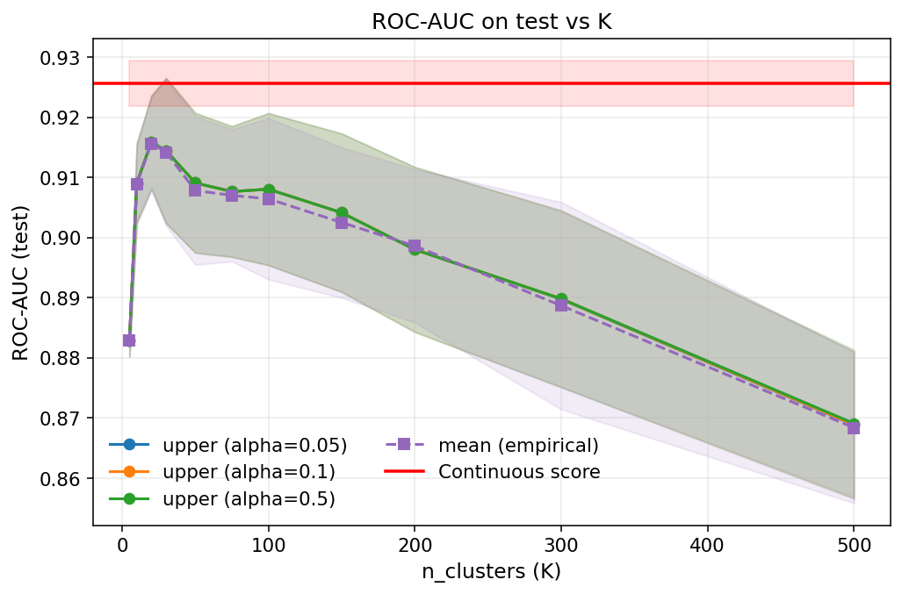
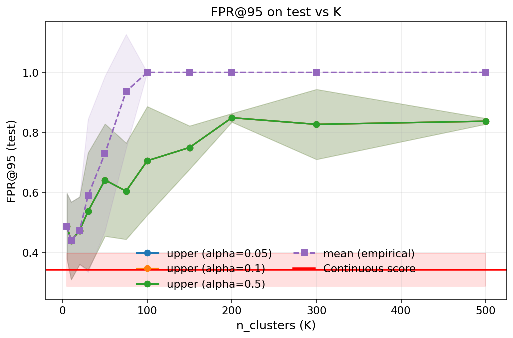
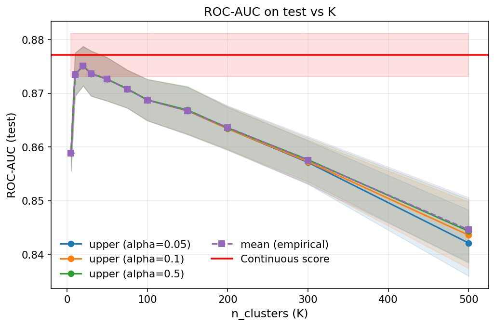
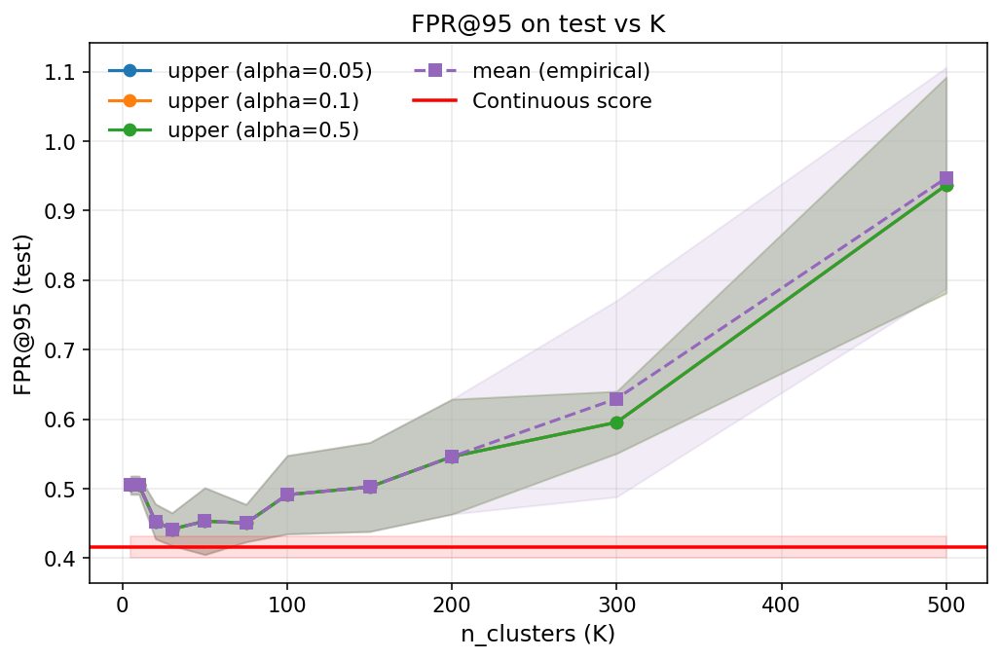

# Uniform-Mass Binning Investigation Report

Last updated: 2026-01-08

## Objective
Quantify how uniform-mass binning behaves when only a calibration split is available (n_cal=5000, n_res=0), and compare upper-bound scoring vs empirical-mean scoring against the continuous-score baseline.

## Experimental setup (cal-only)
- Datasets: CIFAR-10, CIFAR-100
- Model: ResNet-34 (preprocessor: `ce`)
- Score space: gini, temperature = 1.0
- Splits: res = 0, cal = 5000, test = 5000
- Seed splits: 1–9
- Binning: uniform-mass bins learned on cal, CIs computed on cal
- Metrics: ROC-AUC, FPR@95 on test

## Curves shown
- Upper CI score with alpha in {0.05, 0.1, 0.5}
- Empirical mean score per bin
- Continuous score baseline (red horizontal line)
- Alpha affects only the upper-bound curve; the mean curve is alpha-invariant.

## Plots

### CIFAR-10 / ResNet-34



### CIFAR-100 / ResNet-34



## Reproduce
Use `ablation_k_test_curve.py` with cal-only splits and seeds 1–9, then copy the plots into `partition_binning_assets/`.

Example (CIFAR-10):
```bash
python scripts/diagnostics/ablation_k_test_curve.py \
  --latent-path <latent/full.pt> \
  --output-dir ./results/partition_binning/calonly_alpha/cifar10 \
  --output-prefix unif_mass_calonly_alpha_cifar10 \
  --n-res 0 \
  --n-cal 5000 \
  --n-test 5000 \
  --seed-splits 1 2 3 4 5 6 7 8 9 \
  --n-classes 10 \
  --k-values 5 10 20 50 100 200 500 \
  --space gini \
  --temperature 1.0 \
  --alpha-values 0.05 0.1 0.5 \
  --include-mean \
  --include-continuous \
  --bin-split cal \
  --ci-split cal
```

Example (CIFAR-100):
```bash
python scripts/diagnostics/ablation_k_test_curve.py \
  --latent-path <latent/full.pt> \
  --output-dir ./results/partition_binning/calonly_alpha/cifar100 \
  --output-prefix unif_mass_calonly_alpha_cifar100 \
  --n-res 0 \
  --n-cal 5000 \
  --n-test 5000 \
  --seed-splits 1 2 3 4 5 6 7 8 9 \
  --n-classes 100 \
  --k-values 5 10 20 50 100 200 500 \
  --space gini \
  --temperature 1.0 \
  --alpha-values 0.05 0.1 0.5 \
  --include-mean \
  --include-continuous \
  --bin-split cal \
  --ci-split cal
```

Copy the resulting `*_roc_auc.png` and `*_fpr.png` plots into `partition_binning_assets/` using the filenames referenced above.
