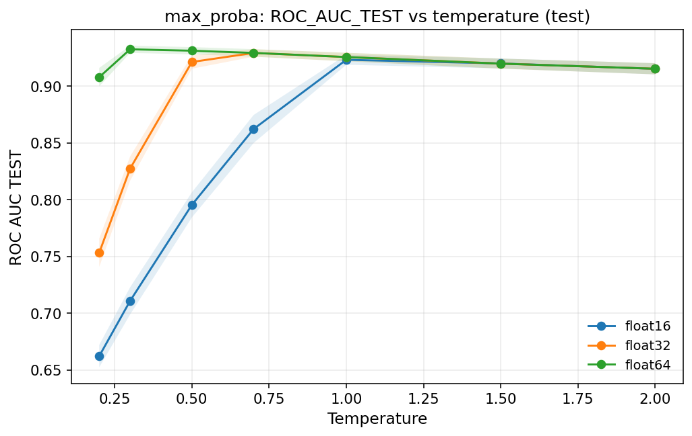
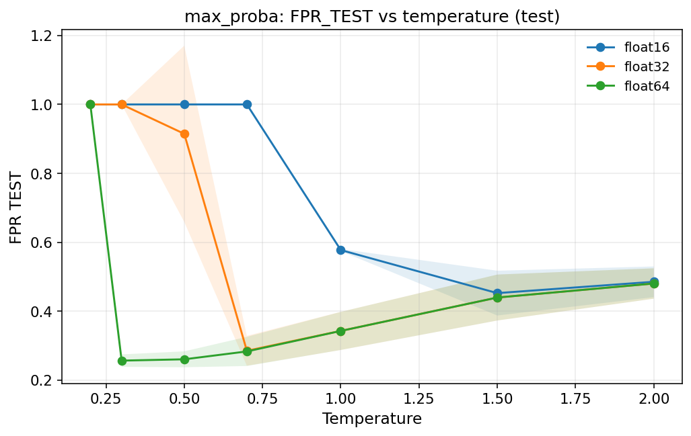
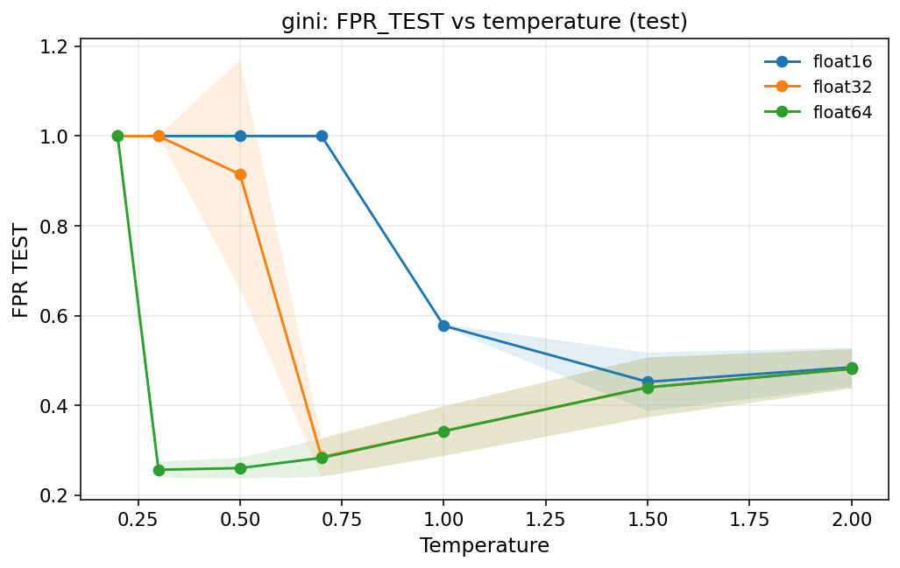
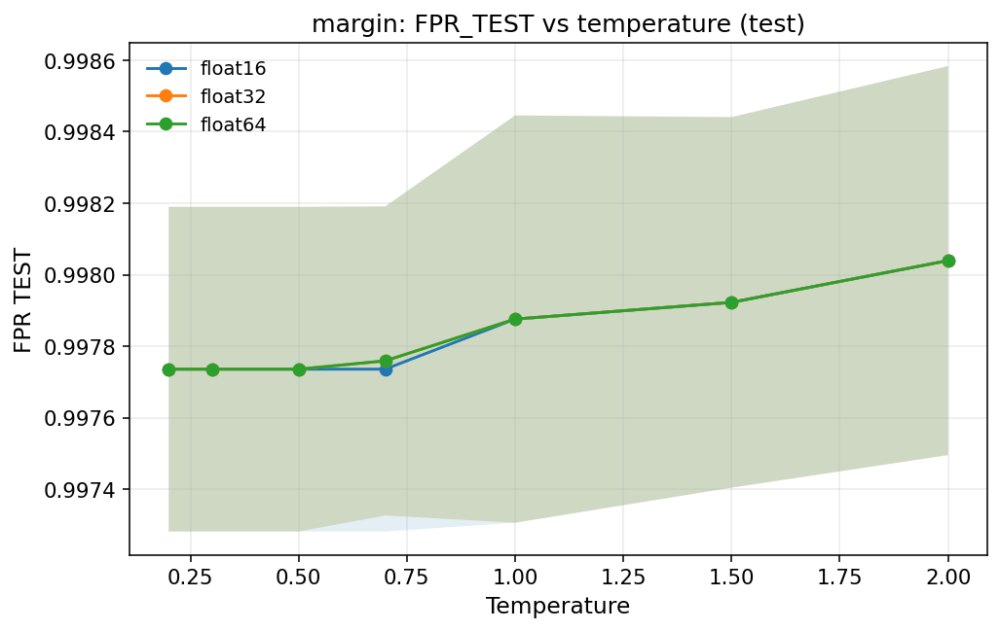

# Test Performance vs Temperature (Scores × Precision)

Last updated: 2026-01-08

## Objective
Measure test-set detection performance of continuous scores as a function of temperature, across multiple splits and float precisions, to understand how temperature affects ranking quality.

## Setup
- Latent file: `error-estimation/latent_cache/cifar10_resnet34_ce_transform-test_n-epochs-1_full.pt`
- Splits: res=0, cal=5000, test=5000 (seed splits 1–9)
- Scores:
  - `max_proba`: negative max softmax probability (higher = more error-like)
  - `gini`: 1 − sum(p^2) (higher = more uncertain)
  - `margin`: max proba − second max proba (higher = more confident)
- Temperatures: 0.2, 0.3, 0.5, 0.7, 1.0, 1.5, 2.0
- Precisions: float16, float32, float64
- Metrics: ROC-AUC and FPR@95 on test

Note: `margin` is reported in its raw form (higher = more confident), so it is directionally opposite to the error score used by the other two. This yields low ROC-AUC as expected; if you want a comparable error score, use `-margin`.

## Plots (mean ± std over seeds 1–9)









## Reproduce
```bash
python scripts/diagnostics/score_temperature_test_curve.py \
  --latent-path latent_cache/cifar10_resnet34_ce_transform-test_n-epochs-1_full.pt \
  --output-dir docs/partition_binning_assets/score_temperature \
  --n-res 0 \
  --n-cal 5000 \
  --n-test 5000 \
  --seed-splits 1 2 3 4 5 6 7 8 9 \
  --temperatures 0.2 0.3 0.5 0.7 1.0 1.5 2.0 \
  --scores max_proba gini margin \
  --dtypes float16 float32 float64
```
